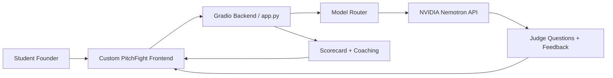

<div align="center">

# ⚔️ PitchFight AI

### Your first tough pitch should not be in front of a real judge.

**An AI founder pressure arena where student builders practice startup pitches, survive judge-style questions, enter a deal round, and leave with a scorecard that shows exactly what to fix.**

**Try it:** [Live Space](YOUR_SPACE_LINK_HERE) · [Demo Video](YOUR_DEMO_VIDEO_LINK_HERE) · [Hugging Face Blog](YOUR_HF_BLOG_LINK_HERE) · [GitHub](YOUR_GITHUB_LINK_HERE)

<a href="YOUR_SPACE_LINK_HERE">
  
</a>

**⚔️ Click the arena above to try PitchFight AI.**

</div>

---

## TL;DR for Judges

- **Backyard AI:** PitchFight AI helps student founders practice before hackathons, demo days, mentor reviews, and pitch rooms.
- **NVIDIA Nemotron Quest:** The judge reasoning is powered by NVIDIA Nemotron through the backend API.
- **Off Brand:** The app uses a custom cinematic frontend instead of default Gradio components.
- **Best Demo:** The submission includes a live Space, demo video, and Hugging Face Blog write-up.
- **Field Notes:** `FIELD_NOTES.md` and the Hugging Face Blog explain the product idea, build decisions, and technical approach.
- **Community Choice:** The public Space is available for users to try and upvote.
- **Judges' Wildcard:** PitchFight AI combines founder tooling, coaching, voice, and pressure simulation in one focused demo.

---

## Why this exists

Most student founders do not lose because their idea is bad.

They lose because the first hard question comes too late.

> "What is your moat?"  
> "Who exactly pays?"  
> "Why now?"  
> "What happens if a bigger player copies this?"

PitchFight AI gives student builders a private practice room before the real room. It turns pitch practice into a pressure battle so founders can sharpen their story, defend their idea, and build confidence before facing real judges.

---

## What you can do

- **Enter your startup idea.** Start with a raw pitch or load a demo founder.
- **Get a founder briefing.** The system structures your idea into problem, solution, users, traction, competitors, and ask.
- **Choose your opponent.** Face a Skeptical VC, Technical Judge, or Hackathon Judge.
- **Pick the pressure level.** Practice Mode, Judge Mode, and Investor Mode change the intensity.
- **Survive pitch rounds.** Answer realistic follow-up questions based on your pitch.
- **Use voice mode.** Practice pitching and answering out loud.
- **Enter the deal phase.** Defend your ask in a negotiation-style pressure round.
- **Get a scorecard.** See what landed, what broke, and what to improve next.

---

## Demo

**Watch the demo:** [YOUR_DEMO_VIDEO_LINK_HERE](YOUR_DEMO_VIDEO_LINK_HERE)

<a href="YOUR_DEMO_VIDEO_LINK_HERE">
  
</a>

**Live Space:** [YOUR_SPACE_LINK_HERE](YOUR_SPACE_LINK_HERE)  
**Build write-up:** [YOUR_HF_BLOG_LINK_HERE](YOUR_HF_BLOG_LINK_HERE)

---

## How it is built

PitchFight AI runs as a Hugging Face Gradio Space, but the user experience is built as a custom frontend rather than a default Gradio interface.

The frontend talks to backend routes in `app.py`. The backend handles pitch structuring, judge personas, battle state, voice mode, deal rounds, and scorecard generation. NVIDIA Nemotron is used as the core reasoning model for the AI judge.



---

## System flow

1. The founder submits or records a startup pitch.
2. The backend structures the pitch into a founder briefing.
3. The founder chooses an opponent and difficulty mode.
4. The AI judge asks multi-round follow-up questions.
5. The founder answers under pressure.
6. The system evaluates clarity, confidence, defensibility, and traction.
7. The founder enters a deal-style round.
8. The final scorecard highlights strengths, weak points, and retry suggestions.

---

## Tech stack

| Layer                | Technology                          |
| -------------------- | ----------------------------------- |
| Hosting              | Hugging Face Spaces                 |
| Runtime              | Gradio                              |
| Backend              | Python, `app.py`, custom API routes |
| Frontend             | Custom HTML, CSS, JavaScript        |
| AI Judge             | NVIDIA Nemotron                     |
| Voice Support        | Nemotron Omni / voice pipeline      |
| Audio Support        | ffmpeg                              |
| Optional Persistence | MongoDB                             |
| Deployment Secrets   | Hugging Face Space Secrets          |

---

## NVIDIA usage

PitchFight AI uses NVIDIA Nemotron as the core judge and reasoning model.

The backend calls the NVIDIA API through:

```text
https://integrate.api.nvidia.com/v1
```

Primary model:

```text
nvidia/nemotron-3-nano-omni-30b-a3b-reasoning
```

The model is used for:

- founder brief structuring
- judge persona reasoning
- pitch battle follow-up questions
- deal round pressure
- final scorecard feedback

`NVIDIA_API_KEY` is stored only as a backend secret and is never exposed to frontend JavaScript.

---

## Built for the Build Small Hackathon

PitchFight AI was built for the Hugging Face **Build Small Hackathon**.

The goal was to create a focused AI product that feels genuinely useful through structured reasoning, judge personas, voice interaction, and a polished custom interface.

| Prize / Badge             | Status    | Why PitchFight AI qualifies                                                       |
| ------------------------- | --------- | --------------------------------------------------------------------------------- |
| **Backyard AI**           | Submitted | Helps student founders practice for real-world pitch situations.                  |
| **NVIDIA Nemotron Quest** | Submitted | Uses NVIDIA Nemotron as the core reasoning model.                                 |
| **Off Brand**             | Submitted | Fully custom cinematic frontend, not default Gradio UI.                           |
| **Best Demo**             | Submitted | Live Space, demo video, and blog write-up are linked.                             |
| **Field Notes**           | Submitted | Hugging Face Blog and `FIELD_NOTES.md` explain the idea, build, and tech.         |
| **Community Choice**      | Eligible  | Public Space is available for users to try and upvote.                            |
| **Judges' Wildcard**      | Eligible  | PitchFight AI combines founder tooling, coaching, voice, and pressure simulation. |

### Not claiming

- **OpenBMB / MiniCPM:** PitchFight AI uses NVIDIA Nemotron, not MiniCPM.
- **Modal:** Not claimed unless Modal is used in development or runtime.
- **Tiny Titan:** Not claimed because the primary model is not ≤4B.
- **Off the Grid:** Not claimed because the app uses the NVIDIA hosted API.
- **Fine-tuning:** Not claimed. Inference uses the hosted Nemotron API only.

---

## Submission links

| Item              | Link                               |
| ----------------- | ---------------------------------- |
| Live Space        | YOUR_SPACE_LINK_HERE               |
| Demo Video        | YOUR_DEMO_VIDEO_LINK_HERE          |
| Hugging Face Blog | YOUR_HF_BLOG_LINK_HERE             |
| GitHub Repository | YOUR_GITHUB_LINK_HERE              |
| Field Notes       | [`FIELD_NOTES.md`](FIELD_NOTES.md) |

---

## Hugging Face deployment

Required Space secret:

```bash
NVIDIA_API_KEY=
```

Optional variables:

```bash
APP_ENV=production
MAX_ROUNDS=6
DEFAULT_MODEL_MODE=premium_nvidia
NVIDIA_BASE_URL=https://integrate.api.nvidia.com/v1
NVIDIA_OMNI_MODEL=nvidia/nemotron-3-nano-omni-30b-a3b-reasoning
ENABLE_DECK_CRITIQUE=true
ENABLE_DEAL_BATTLE=true
ENABLE_VOICE_MODE=true
MONGODB_URI=
```

Never put API keys in frontend code or commit real secrets to GitHub.

---

## Run locally

```bash
python -m venv venv
.\venv\Scripts\Activate.ps1
pip install -r requirements.txt
cp .env.example .env
python app.py
```

Open:

```bash
http://127.0.0.1:7860
```

Install `ffmpeg` locally if using voice mode.

---

## Project structure

```text
.
├── app.py                 Gradio app entrypoint and backend routes
├── requirements.txt       Python dependencies
├── packages.txt           System packages such as ffmpeg
├── .env.example           Local environment variable template
├── assets/                Screenshots for README and submission
├── frontend/              Custom HTML, CSS, JS, and UI assets
├── core/                  Backend handlers, model router, clients
├── FIELD_NOTES.md         Build notes for the Field Notes badge
└── README.md              Space card and hackathon submission write-up
```

---

## Safety note

PitchFight AI is a practice and coaching tool. It does not replace real mentors, investors, or legal/financial advisors. It is designed to help founders sharpen their pitch before entering the real room.

---

<div align="center">

**If your pitch can survive the arena, it has a better chance in the room.**

</div>
