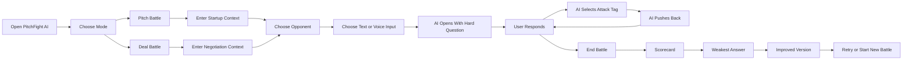

# ⚔️ PitchFight AI — Final Hackathon-Aligned Documentation

## A Voice-and-Text AI Sparring Arena for Student Founders (≤32B Models)

> **Your first tough pitch should not be in front of a real judge.**  
> **Normal AI assistants give advice. PitchFight AI creates pressure.**

### Strategy Update (Current Build)

This documentation reflects the **high-demo sponsor-model strategy**. PitchFight AI prioritizes demo strength, model quality, and sponsor alignment (NVIDIA Nemotron Omni, OpenBMB MiniCPM) while staying under the **≤32B** Build Small Hackathon rule.

> **Off-the-Grid is not targeted.** Premium default model mode is **NVIDIA Nemotron Omni** (backend-only). API keys live in `.env` locally / HF Space Secrets in deployment — never in the frontend.

See also: [`PHASE_WISE_PLAN.md`](PHASE_WISE_PLAN.md) · [`MODELS_FINAL.md`](MODELS_FINAL.md) · [`BACKEND_API.md`](BACKEND_API.md)

PitchFight AI exposes **clean custom project APIs under `/api/...`**. Gradio internal routes may appear in OpenAPI/Swagger, but they are **framework runtime routes**, not product endpoints.

---

## 1. Project Overview

**PitchFight AI** is a Hugging Face Spaces + Gradio Server application that helps student founders practice high-pressure startup pitching before facing real judges, mentors, investors, sponsors, recruiters, or clients.

The project is built for the **Backyard AI** track of the Build Small Hackathon. The target user is intentionally narrow:

> **Student founders and hackathon builders who know their project, but freeze when someone asks hard questions.**

PitchFight AI turns pitch practice into a realistic AI sparring arena. The AI does not behave like a generic assistant. It behaves like a skeptical counterpart, asks tough follow-up questions, remembers previous answers, detects weak claims, scores the conversation, and rewrites the weakest answer into a stronger response.

---

## 2. Hackathon Rule Alignment

This section is intentionally explicit so the project does not violate the hackathon constraints.

### Required Rules

| Rule | How PitchFight AI Complies |
|---|---|
| **Small Models Only** | All models stay under the 32B parameter cap: Nemotron 3 Nano Omni (~30B), MiniCPM-o, MiniCPM5-1B, MiniCPM-V 4.6. |
| **Built on Gradio** | Gradio Server app hosted as a Hugging Face Space with custom HTML/CSS/JS frontend. |
| **Show, Don’t Tell** | Demo-first: pitch battle, voice mode, deal battle, scorecard — runnable in the Space. |
| **No Frontend Model Calls** | Browser calls only `/api/...` endpoints via `fetch()`; model APIs are backend-only. |

### Sponsor-Model / High-Demo Strategy

The **default submitted build** prioritizes the strongest demonstrative experience:

- **NVIDIA Nemotron Omni** — primary premium judge (text, voice, multimodal, scoring).
- **OpenBMB MiniCPM** — MiniCPM-o (omni), MiniCPM5-1B (tiny/fallback), MiniCPM-V 4.6 (deck critique).
- **faster-whisper** — backup local transcription when Omni voice path is unavailable.
- **No browser-side model API calls** — all keys in HF Space Secrets / backend `.env`.
- **No OpenAI or unrelated cloud APIs** in the default flow.

### Off-the-Grid Position

> **Off-the-Grid is intentionally not targeted.** Sponsor/model APIs are used for demo quality. The project instead targets Backyard AI, Best Demo, Best Agent, Off-Brand, NVIDIA Nemotron Quest, OpenBMB Awards, Sharing is Caring, and Field Notes.

### Final Compliance Position

> **PitchFight AI follows hackathon core rules: ≤32B models, Gradio/HF Spaces, demo-first execution, backend-only inference with secrets managed server-side.**

---

## 3. Core Problem

Most student founders prepare their pitch by:

- Reading pitch tips online
- Practicing alone
- Showing their idea to friends who say “sounds good”
- Making slides but not preparing for hard Q&A

The first real pressure often happens during judging, mentoring, investor review, or sponsorship calls. That is exactly when many students freeze.

### Gap

There is no easy, low-cost, always-available sparring partner that can simulate:

- A skeptical hackathon judge
- A technical evaluator
- A hard investor
- A sponsor asking for ROI
- A recruiter or client pushing back

### PitchFight AI’s Solution

PitchFight AI creates a **pressure simulation loop**:

1. User enters startup/project context.
2. User chooses an AI opponent.
3. AI opponent asks one sharp question at a time.
4. User responds under pressure.
5. AI follows up on weak or vague answers.
6. App generates a scorecard and improved answer.

---

## 4. Final Product Scope

### Primary Mode: Pitch Battle

The user defends their startup or hackathon project against a persona-locked AI opponent.

#### Personas

| Persona | Role | What They Attack |
|---|---|---|
| **Skeptical VC** | Investor-style evaluator | Market, moat, revenue, defensibility, retention |
| **Technical Judge** | Engineering evaluator | AI necessity, architecture, scalability, feasibility |
| **Hackathon Judge** | Competition evaluator | Novelty, demo clarity, MVP strength, real-world usefulness |

### Secondary Mode: Deal Battle

The user practices negotiation scenarios useful for student founders and early-career builders.

#### Scenarios

| Scenario | Counterpart |
|---|---|
| Startup Sponsorship Ask | Tough sponsor |
| Internship Salary Negotiation | Strict HR recruiter |
| Freelance Client Pricing | Budget-conscious client |
| Equity Negotiation | Investor negotiating hard |

### Voice Mode

Voice Mode allows the user to speak their pitch instead of typing it.

For the MVP, Voice Mode is intentionally simple and reliable:

```text
User records pitch audio
        ↓
Backend /api/voice-pitch (frontend never calls model APIs)
        ↓
Primary: NVIDIA Nemotron Omni interprets audio + asks first hard question
        ↓
Fallback: faster-whisper transcribes → Nemotron or MiniCPM5-1B text path
        ↓
User continues by text or voice
        ↓
Scorecard includes voice-derived structure and conciseness signals
```

Founders normally pitch out loud; the premium voice path uses Nemotron Omni backend-only, with faster-whisper as transcription fallback only.

---

## 5. What Makes This a Strong Hackathon Project

PitchFight AI is designed around the hackathon’s judging taste: runnable, specific, useful, delightful, and more than a chatbot wrapper.

### Runnable Gradio Space

The final app is deployed as a Hugging Face Space using Gradio.

### Clear Purpose

The app has one clear mission:

> Help student founders survive tough pitch and negotiation conversations before the real moment.

### Useful + Delightful

Useful: improves pitch readiness.  
Delightful: feels like entering a battle arena instead of filling a boring form.

### More Than a Chatbot Wrapper

PitchFight AI includes:

- Startup context intake
- Persona selection
- Round-based battle flow
- Pressure level
- Attack tags
- Conversation memory
- Voice pitch mode
- Rubric-based scoring
- Weakest answer detection
- Improved answer rewrite
- Final pitch rewrite
- Scorecard screen

### Small Model Showcase

The project uses compact models strategically rather than relying on one huge model. The intelligence comes from:

- Strong persona prompts
- Memory
- Role consistency
- Attack-tag routing
- Rubric scoring
- faster-whisper transcription fallback (when Omni voice path is unavailable)
- Feedback generation

---

## 6. Final System Architecture

```mermaid
flowchart TD
    A[Student Founder] --> B[Custom Web UI — fetch to /api/* only]

    B --> C{Input Mode}
    C -->|Text Pitch| D[Startup Context Form]
    C -->|Voice Pitch| E[Browser Audio Recorder]

    D --> H[Session Manager]
    E --> VP[/api/voice-pitch]
    VP --> F[NVIDIA Nemotron Omni — primary voice path]
    VP --> W[faster-whisper — transcription fallback only]
    F --> H
    W --> H

    H --> I[Persona Prompt Builder]
    I --> J[Attack Tag Selector]
    J --> K[Battle Engine]

    K --> MR[Model Router]
    MR --> L1[NVIDIA Nemotron Omni — default premium judge]
    MR --> L2[MiniCPM-o 4.5 — OpenBMB omni mode]
    MR --> L3[MiniCPM5-1B — tiny / API-failure fallback]
    MR --> L4[MiniCPM-V 4.6 — deck critique]
    L1 --> M[AI Opponent Response]
    L2 --> M
    L3 --> M
    M --> B

    H --> N[Scoring Engine]
    N --> MR
    MR --> O[Structured Scorecard JSON]
    O --> P[JSON Parser + Fallback Handler]
    P --> Q[Feedback Generator]
    Q --> R[Scorecard + Improved Answer]
    R --> B
```

### Simple Explanation

- The **custom frontend** handles the arena UI and calls only **`/api/...`** endpoints — never model provider APIs.
- **Gradio Server** exposes backend APIs and serves the custom frontend.
- The **Session Manager** stores startup details, chosen persona, round count, attack tags, and conversation history.
- The **Persona Prompt Builder** creates the opponent behavior.
- The **Attack Tag Selector** decides what kind of pressure the AI should apply next.
- The **Model Router** routes inference to **NVIDIA Nemotron Omni** by default, with OpenBMB MiniCPM modes and MiniCPM5-1B fallback.
- **faster-whisper** is backup transcription only when the Omni voice path is unavailable.
- API keys live in **HF Space Secrets** / backend `.env` only — never in frontend code.
- The **Scorecard UI** shows what went well, what failed, and how to improve.

---

## 7. User Workflow Diagram



---

## 8. Final Model Strategy

The core model table is kept intentionally small. Every model listed here has a real job in the submitted app.

| Model | Type | Where Used | Why Used |
|---|---|---|---|
| **NVIDIA Nemotron 3 Nano Omni** | Premium multimodal LLM (≤30B) | Primary judge: pitch battle, voice, deal battle, scoring, rewrites | Best demo quality; NVIDIA Nemotron Quest alignment |
| **MiniCPM-o 4.5** | OpenBMB omni model | OpenBMB sponsor mode, multimodal fallback | OpenBMB Awards alignment |
| **MiniCPM5-1B** | Tiny text LLM | Tiny Mode, API failure fallback | Speed + Tiny Titan eligibility |
| **MiniCPM-V 4.6** | Vision model | Pitch deck / slide critique | Image-based judge questions |
| **faster-whisper (tiny/base)** | Local STT | Voice fallback transcription | Reliable backup when Omni voice path fails |

### Fallback Model Note

`core/model_router.py` routes to **Tiny MiniCPM5-1B** or **whisper_fallback** when premium APIs timeout, fail, or keys are missing. UI shows active mode badge (Premium Nemotron / OpenBMB Omni / Tiny MiniCPM).

---

## 9. Exact Use of Each Model

### 9.1 NVIDIA Nemotron Omni — Primary Premium Model

Used for:

- AI opponent responses and follow-ups
- Voice pitch interpretation and first hard question
- Deal battle counterpart dialogue
- Scorecard generation (structured JSON)
- Weakest answer rewrite and 60-second pitch rewrite
- Optional multimodal deck + spoken pitch critique

#### Backend Client

`core/nvidia_client.py` — secure calls via `NVIDIA_API_KEY` and `NVIDIA_BASE_URL`. Never exposed to frontend.

### 9.1b MiniCPM Models — OpenBMB + Fallback

**MiniCPM-o 4.5** — OpenBMB omni mode. **MiniCPM5-1B** — tiny/fallback text. **MiniCPM-V 4.6** — slide critique.

#### Runtime Options

| Runtime | Use Case |
|---|---|
| OpenBMB API / HF inference | Primary OpenBMB sponsor path |
| Local `transformers` / quantized | Tiny Mode on Space hardware if needed |

#### Suggested Settings

| Task | Temperature | Max Tokens |
|---|---:|---:|
| Opponent response | 0.7–0.8 | 180–260 |
| Scorecard | 0.1–0.3 | 900–1400 |
| Rewrite weak answer | 0.4–0.5 | 400–600 |
| Final pitch rewrite | 0.5–0.6 | 400–700 |

---

### 9.2 Whisper Tiny/Base — Local Voice Input

Used for:

- Spoken pitch transcription
- Spoken answer transcription
- Generating a transcript for the text battle engine
- Voice add-on metrics based on transcript structure

#### Voice Flow (Primary)

```text
Browser records audio
  → /voice_pitch API
  → NVIDIA Nemotron Omni (audio + prompt)
  → structured pitch context + first hard question
  → Pitch Battle continues (voice or text)
```

#### Voice Flow (Fallback)

```text
Browser records audio
  → faster-whisper local transcription
  → transcript → selected text model (Nemotron or MiniCPM5-1B)
  → normal Pitch Battle flow
```

---

### 9.3 Pitch Deck Critique — MiniCPM-V / Nemotron Vision

Used for:

- Slide screenshot upload via `/deck_critique`
- Claim extraction and clarity critique
- Three judge prep questions per slide

Primary: **MiniCPM-V 4.6**. Alternate: Nemotron Omni vision path.

---

## 10. Tools and Their Exact Usage

| Tool / Platform | Use in PitchFight AI |
|---|---|
| **Hugging Face Spaces** | Final deployment platform |
| **Gradio Server** | Gradio backend server with custom route support |
| **FastAPI `/api/*` routes** | Product endpoints: `/api/start-session`, `/api/chat-round`, `/api/end-battle`, etc. |
| **Gradio `@app.api` wrappers** | Compatibility aliases calling the same `core/api_handlers.py` functions |
| **Custom HTML/CSS/JS** | Makes the UI look like a battle arena instead of default Gradio |
| **Browser `fetch()`** | Frontend calls `/api/*` endpoints only — never model provider APIs |
| **faster-whisper** | Audio transcription fallback when Nemotron Omni voice path is unavailable |
| **Hugging Face Hub** | Model download and project sharing |
| **HF Space Secrets** | NVIDIA, OpenBMB, and HF tokens for backend-only inference (never exposed to frontend) |
| **GitHub / HF repo** | Version control and project sharing |
| **Mermaid diagrams** | Architecture and workflow documentation |
| **Cursor Agent** | Frontend implementation and UI polish |
| **Claude Code** | File generation, backend modules, refactoring |
| **ChatGPT** | Planning, architecture, prompt design, debugging strategy, documentation |

---

## 11. Backend API Design

The frontend should never call model runtime code directly. All model calls go through the Python backend.

### Correct Flow

```text
Browser UI → /api/* (fetch) → api_handlers → model_router → NVIDIA / OpenBMB / whisper clients
```

### Wrong Flow

```text
Browser UI → External model API directly
```

This would expose API keys. All model calls must stay on the backend.

---

### 11.1 `/start_session`

Starts a new battle session.

#### Input

```json
{
  "mode": "pitch_battle",
  "persona": "hackathon_judge",
  "difficulty": "high",
  "input_mode": "text",
  "startup": {
    "name": "EventRadar AI",
    "problem": "Students miss hackathons and tech events because discovery is scattered.",
    "target_users": "College students and early-stage builders",
    "solution": "AI-powered event matching based on goals, skills, location, and urgency",
    "why_ai": "The model ranks and explains relevance instead of just listing events",
    "competitors": "Luma, LinkedIn Events, WhatsApp groups",
    "traction": "Prototype with scraped event data and ranking logic",
    "ask": "Hackathon prize and mentor feedback"
  }
}
```

#### Output

```json
{
  "session_id": "abc123",
  "round": 1,
  "pressure_level": "High",
  "attack_tag": "AI Justification",
  "ai_message": "Why does this need AI? A sorted event list with filters seems enough. What is the intelligence here?"
}
```

---

### 11.2 `/chat_round`

Processes one user answer and returns the next AI pushback.

#### Input

```json
{
  "session_id": "abc123",
  "user_message": "The AI ranks events based on the student's profile and explains why each event matters."
}
```

#### Output

```json
{
  "round": 2,
  "pressure_level": "High",
  "attack_tag": "Retention",
  "ai_message": "That explains matching, not retention. Why would a student return every week instead of checking once before placement season?"
}
```

---

### 11.3 `/voice_pitch`

Accepts an audio file. Primary path: Nemotron Omni voice interpretation. Fallback: faster-whisper transcription.

#### Input

```json
{
  "audio_file": "pitch.wav",
  "persona": "skeptical_vc"
}
```

#### Output

```json
{
  "transcript": "We are building EventRadar AI...",
  "detected_startup_context": {
    "name": "EventRadar AI",
    "problem": "students miss events",
    "solution": "AI event matching"
  },
  "opening_question": "You are describing discovery, but where is the urgency? Why is this painful enough for students to change behavior?"
}
```

Implementation detail:

- **Primary:** audio sent to NVIDIA Nemotron Omni via backend; model extracts pitch context and opening question.
- **Fallback:** faster-whisper transcribes locally; transcript routed to Nemotron or MiniCPM5-1B text path.
- If context extraction is uncertain, the UI asks the user to quickly edit the detected fields before the battle starts.

---

### 11.4 `/end_battle`

Scores the conversation.

#### Input

```json
{
  "session_id": "abc123"
}
```

#### Output

```json
{
  "overall": 68,
  "scores": {
    "clarity": {
      "score": 76,
      "reason": "The user explained the workflow clearly but took too long to state the core value.",
      "quote": "It ranks events based on a student's profile."
    },
    "problem_understanding": {
      "score": 70,
      "reason": "The user described the problem but did not provide evidence of frequency or severity.",
      "quote": "Students miss hackathons because discovery is scattered."
    }
  },
  "best_answer": {
    "quote": "The app explains why each event is relevant instead of only listing it.",
    "why": "This differentiated the product from a basic directory."
  },
  "weakest_answer": {
    "quote": "Students will use it because it is helpful.",
    "why": "This answer was vague and did not address retention or urgency."
  },
  "improved_answer": "Students return because the system continuously tracks deadlines, skill fit, team requirements, and local event updates. It becomes a weekly opportunity radar, not a one-time event list.",
  "improved_pitch": "EventRadar AI helps students discover the right hackathons and tech events by matching opportunities to their skills, goals, location, and urgency. Unlike static event lists, it explains why each event matters and helps students act before deadlines.",
  "top_3_questions": [
    "Why does this need AI instead of filters?",
    "What makes users return weekly?",
    "How will you get your first 100 active users?"
  ]
}
```

---

## 12. Attack Tag Taxonomy

Attack tags make PitchFight AI feel structured instead of random. The AI should rotate through known pressure points based on the selected persona and the user’s previous answer.

### 12.1 Skeptical VC Attack Tags

| Attack Tag | What It Tests | Example Question |
|---|---|---|
| Market Size | Whether the opportunity is big enough | “How many people have this problem badly enough to pay or change behavior?” |
| Moat | Whether the idea is defensible | “What stops a larger platform from copying this in a week?” |
| Retention | Whether users come back | “Why would someone open this again after the first use?” |
| Revenue Logic | Whether there is a path to money/value | “Who pays, how much, and why would they keep paying?” |
| First 100 Users | Whether acquisition is realistic | “How exactly do you get the first 100 active users without paid ads?” |
| Why Now | Whether timing is convincing | “Why is this urgent now instead of two years ago or two years later?” |
| Competition | Whether existing alternatives are understood | “Why does your user choose this over what they already do today?” |

### 12.2 Technical Judge Attack Tags

| Attack Tag | What It Tests | Example Question |
|---|---|---|
| AI Justification | Whether AI is actually needed | “What does the model do that filters or rules cannot?” |
| Architecture | Whether the system design is clear | “Where exactly does inference happen, and what data flows through it?” |
| Scalability | Whether the system can grow | “What breaks first when 100 users become 10,000?” |
| Latency | Whether the UX is practical | “How long does one response take, and what happens when it is slow?” |
| Data Quality | Whether input data is reliable | “Where does your data come from, and how do you handle missing or wrong data?” |
| Failure Mode | Whether the team knows what can go wrong | “What is the worst wrong output your system can produce?” |
| Simpler Alternative | Whether the build is overengineered | “Could this be done with a form and rules? Why is your system better?” |

### 12.3 Hackathon Judge Attack Tags

| Attack Tag | What It Tests | Example Question |
|---|---|---|
| Novelty | Whether the project is memorable | “I have seen similar ideas. What is the one thing I will remember?” |
| Demo Clarity | Whether the demo lands quickly | “Can you show the value in 30 seconds?” |
| MVP Strength | Whether the prototype actually works | “What part is fully working right now, not just planned?” |
| User Pain | Whether the problem is real | “Who exactly has this problem, and how do you know?” |
| AI Load-Bearing | Whether AI is central | “If I remove the model, does the product collapse or still work?” |
| Backyard Fit | Whether it helps a real person | “Who used this, and what got better for them?” |
| Practical Impact | Whether it matters beyond the demo | “What changes for the user after using this?” |

### 12.4 Deal Battle Attack Tags

| Attack Tag | What It Tests | Example Question |
|---|---|---|
| Anchoring | Whether the user sets a clear position | “What number are you asking for, and why that number?” |
| Evidence | Whether claims are backed by proof | “What proof do you have that you are worth that ask?” |
| Concession | Whether the user gives up too early | “If I say no, what do you offer without lowering the value?” |
| Mutual Value | Whether both sides benefit | “Why is this good for me, not just for you?” |
| Closing | Whether the user moves toward action | “What exact next step are you asking me to agree to?” |

---

## 13. Core Prompt Design

### 13.1 Opponent System Prompt

```text
You are {persona_name}, a realistic evaluator speaking to a student founder.

Your job is not to encourage. Your job is to pressure-test the founder's thinking.

Startup context:
- Name: {name}
- Problem: {problem}
- Target users: {target_users}
- Solution: {solution}
- Why AI: {why_ai}
- Competitors: {competitors}
- Traction: {traction}
- Ask: {ask}

Current attack tag: {attack_tag}

Rules:
1. Ask one sharp question at a time.
2. Keep responses under 4 sentences.
3. Reference the founder's previous answer.
4. Do not give advice during the battle.
5. Do not say "great answer", "interesting", or "that makes sense".
6. If the answer is vague, attack the vague part.
7. If the answer is strong, raise the difficulty.
8. Stay in character.
9. Be firm, realistic, and useful — not abusive.
10. Your response must match the current attack tag.
```

---

### 13.2 Scoring Prompt

```text
You watched a pitch battle between a student founder and an AI evaluator.

Score the founder on:
1. Clarity
2. Problem Understanding
3. Market Awareness
4. Differentiation
5. Business Model
6. Objection Handling

For each dimension:
- Give a score from 0 to 100
- Mention the exact quote that influenced the score
- Give one specific reason

Then identify:
- Best answer
- Weakest answer
- Why the weak answer failed
- Improved version of the weak answer
- Improved 60-second pitch
- Top 3 questions to prepare next

Return valid JSON only.
```

---

## 14. Scoring Rubric

### Pitch Battle

| Dimension | Weight | What It Measures |
|---|---:|---|
| Clarity | 15% | Can a judge understand the idea quickly? |
| Problem Understanding | 20% | Did the founder prove the pain is real? |
| Market Awareness | 15% | Do they know who the first users are? |
| Differentiation | 20% | Why does this beat existing options? |
| Business Model | 15% | Is there a path to value or revenue? |
| Objection Handling | 15% | Did they answer directly or dodge? |

### Deal Battle

| Dimension | Weight | What It Measures |
|---|---:|---|
| Anchoring | 20% | Did the user set a clear position? |
| Evidence Usage | 20% | Did they support the ask with proof? |
| Confidence | 15% | Did they hold ground under pressure? |
| Empathy | 15% | Did they understand the other side’s constraints? |
| Concession Handling | 15% | Did they avoid giving up too fast? |
| Closing | 15% | Did they move toward a clear next step? |

### Voice Mode Add-On Metrics

| Dimension | What It Measures |
|---|---|
| Structure | Did the spoken pitch have a clear beginning, middle, and ask? |
| Conciseness | Did the user avoid rambling? |
| Confidence Signals | Did the transcript show hesitation or unclear phrasing? |
| Directness | Did the user answer the question directly? |

---

## 15. JSON Parsing and Fallback Strategy

Small models can return malformed JSON. The scoring engine must handle this gracefully.

### Fallback Pipeline

```text
1. Try direct JSON parse.
        ↓
2. If parse fails, extract substring from first `{` to last `}` and parse again.
        ↓
3. If still broken, send a model retry prompt via model router:
   “Convert the following response into valid JSON only.”
        ↓
4. If retry fails, use regex to extract numeric scores and key sections.
        ↓
5. If all parsing fails, show a graceful fallback scorecard:
   “Scorecard could not be fully structured, but here is the raw feedback.”
```

### Implementation Notes

- Never expose raw Python errors in the UI.
- Always show something useful to the user.
- Log parse failures in the backend console for debugging.
- Keep a default scorecard schema so the frontend never breaks.

---

## 16. Frontend UI Design

### Design Goal

The app should not look like a basic Gradio demo. It should feel like a polished AI practice arena.

### Screens

1. Landing screen
2. Mode selection
3. Startup / negotiation context form
4. Persona selection
5. Text or voice input selection
6. Battle arena
7. Scorecard screen
8. Retry / new battle screen

### Visual Direction

```text
Theme: Dark Battle Arena
Background: near-black / navy
Primary accent: red
Secondary accent: gold
Cards: dark glassmorphism
Typography: bold headings, clean mono-style chat
Animations: subtle glow, score reveal, pressure meter pulse
```

### UI Elements

- Round counter
- Pressure meter
- Attack tag
- Opponent card
- Founder card
- Voice recording button
- Chat transcript
- End battle button
- Score bars
- Weakest answer highlight
- Improved answer card

---

## 17. Hugging Face Spaces Deployment Plan

### Space Type

```yaml
---
title: PitchFight AI
emoji: ⚔️
colorFrom: red
colorTo: yellow
sdk: gradio
app_file: app.py
pinned: false
---
```

### Core Environment Variables

Set in HF Space Secrets and local `.env` (never commit real keys):

```text
APP_ENV=production
MAX_ROUNDS=6

NVIDIA_API_KEY=<hf-space-secret>
NVIDIA_BASE_URL=https://integrate.api.nvidia.com/v1
NVIDIA_OMNI_MODEL=nvidia/nemotron-3-nano-omni-30b-a3b-reasoning

OPENBMB_API_KEY=<hf-space-secret>
OPENBMB_BASE_URL=
MINICPM_OMNI_MODEL=openbmb/MiniCPM-o-4_5
MINICPM_TEXT_MODEL=openbmb/MiniCPM5-1B
MINICPM_VISION_MODEL=openbmb/MiniCPM-V-4.6

HF_TOKEN=<hf-space-secret>
WHISPER_FALLBACK_ENABLED=true
WHISPER_MODEL_SIZE=tiny
```

Do **not** expose keys in frontend code, README, or public repos.

### Required `packages.txt`

```text
ffmpeg
```

### Important Security Rules

- Never commit real API keys.
- Never put keys in frontend JavaScript.
- Use `.env` locally only for configuration.
- Add `.env` to `.gitignore`.
- Sponsor model API keys (NVIDIA, OpenBMB) are required for the premium demo path; they stay backend-only.

---

## 18. Final Deployment File Structure

```text
pitchfight-ai/
│
├── app.py
├── requirements.txt
├── packages.txt
├── README.md
├── .env.example
├── .gitignore
│
├── core/
│   ├── __init__.py
│   ├── api_handlers.py
│   ├── session_manager.py
│   ├── persona_builder.py
│   ├── attack_tags.py
│   ├── model_router.py
│   ├── nvidia_client.py
│   ├── minicpm_client.py
│   ├── vision_client.py
│   ├── transcription_client.py
│   ├── scoring_engine.py
│   ├── feedback_generator.py
│   ├── json_utils.py
│   └── samples.py
│
├── config/
│   ├── personas.json
│   ├── attack_tags.json
│   ├── pitch_rubric.json
│   ├── deal_rubric.json
│   └── sample_startups.json
│
├── frontend/
│   ├── index.html
│   ├── styles.css
│   ├── script.js
│   └── assets/
│       ├── logo.svg
│       └── icons/
│
├── docs/
│   ├── DOCUMENTATION.md
│   ├── PROMPTS.md
│   ├── DEMO_NOTES.md
│   └── FIELD_NOTES.md
│
└── tests/
    ├── test_prompts.py
    ├── test_attack_tags.py
    └── test_json_parser.py
```

---

## 19. File Responsibilities

### `app.py`

Main Gradio Server entry point.

Responsibilities:

- Create `gradio.Server`
- Serve custom `frontend/index.html`
- Serve static CSS/JS/assets
- Expose backend APIs
- Launch app

### `core/session_manager.py`

Stores active battle sessions.

Responsibilities:

- Create sessions
- Store conversation history
- Track rounds
- Track persona and mode
- Track attack tags
- Return full conversation for scoring

### `core/persona_builder.py`

Builds persona prompts.

Responsibilities:

- Load persona config
- Inject startup or negotiation context
- Add difficulty rules
- Add current attack tag
- Return system prompt

### `core/attack_tags.py`

Controls structured pressure flow.

Responsibilities:

- Store attack tag taxonomy
- Select next attack tag per persona
- Avoid repeating the same attack tag too often
- Increase pressure as rounds progress

### `core/model_router.py`

Backend-only model routing (Phase 2+).

Responsibilities:

- Text battle → NVIDIA Nemotron Omni by default; MiniCPM5-1B on failure
- Voice input → Nemotron Omni primary; faster-whisper transcription fallback
- OpenBMB omni mode → MiniCPM-o 4.5
- Deck critique → MiniCPM-V 4.6 or Nemotron vision path
- Expose active mode badge to frontend (`premium_nvidia`, `openbmb_omni`, `tiny_minicpm`, etc.)

### `core/nvidia_client.py`

Secure NVIDIA Nemotron Omni client (Phase 2+).

Responsibilities:

- Backend-only API calls via `NVIDIA_API_KEY`
- Text, voice, multimodal judge responses
- Scorecard and rewrite generation
- Timeout / retry handling

### `core/minicpm_client.py`

OpenBMB MiniCPM backend client (Phase 2+).

Responsibilities:

- MiniCPM-o omni mode
- MiniCPM5-1B tiny / fallback text generation

### `core/transcription_client.py`

Voice transcription fallback.

Responsibilities:

- Accept audio file
- Run faster-whisper locally when Omni voice path fails
- Return transcript for model router

### `core/vision_client.py`

Deck critique vision client (Phase 2+).

Responsibilities:

- Route slide images to MiniCPM-V 4.6 or Nemotron vision path

### `core/scoring_engine.py`

Generates scorecard.

Responsibilities:

- Build scoring prompt
- Call model router (Nemotron default, MiniCPM5 fallback)
- Parse JSON
- Use fallback strategy if JSON breaks

### `core/feedback_generator.py`

Generates improved answers.

Responsibilities:

- Rewrite weakest answer
- Generate improved pitch
- Generate top 3 prep questions

### `core/json_utils.py`

Keeps frontend stable.

Responsibilities:

- Parse scorecard JSON
- Repair malformed JSON
- Extract fallback sections
- Return default schema if needed

### `frontend/index.html`

Custom UI shell.

Responsibilities:

- Landing page
- Mode selector
- Form screens
- Battle arena
- Scorecard layout

### `frontend/script.js`

Frontend logic.

Responsibilities:

- Call `/api/*` endpoints via `fetch()` only — never model provider APIs
- Manage UI state
- Render messages and scorecards
- Handle audio recording

### `frontend/styles.css`

Visual polish.

Responsibilities:

- Dark battle theme
- Cards
- Animations
- Responsive layout
- Score bars
- Pressure meter

---

## 20. Development Phases

> **Authoritative roadmap:** [`PHASE_WISE_PLAN.md`](PHASE_WISE_PLAN.md) (14 phases, sponsor-model strategy). The summary below aligns with that plan.

This section describes the build order at a high level. The project can be built fast, but the documentation should not contradict itself by calling a full build a “one-day plan.”

### Phase 1 — Project Skeleton

Goal: create working HF Spaces-compatible Gradio Server app.

Deliverables:

- `app.py`
- custom homepage
- `requirements.txt`
- `packages.txt`
- README metadata

Success check:

```text
python app.py
```

opens the custom UI.

---

### Phase 2 — Model Router + Secrets (see PHASE_WISE_PLAN.md)

Goal: backend-only model routing with `DEFAULT_MODEL_MODE=premium_nvidia`.

---

### Phase 3 — Text Battle Engine

Goal: get core pitch battle working.

Deliverables:

- session manager
- persona builder
- attack tag selector
- `/start_session`
- `/chat_round`

Success check:

```text
User can start a pitch battle and get hard follow-up questions.
```

---

### Phase 4 — Scorecard Engine

Goal: turn chat into useful feedback.

Deliverables:

- scoring prompt
- JSON parser
- fallback parser
- `/end_battle`
- scorecard UI

Success check:

```text
User ends battle and sees 6 scores, weakest answer, improved answer, and improved pitch.
```

---

### Phase 5 — Custom UI Polish

Goal: make it look like a product.

Deliverables:

- battle arena layout
- round counter
- pressure meter
- persona cards
- attack tag display
- score animation
- loading states

Success check:

```text
The app visually feels different from default Gradio.
```

---

### Phase 6 — Voice Pitch Mode

Goal: Nemotron Omni primary voice path; faster-whisper transcription fallback only.

Deliverables:

- browser audio recorder
- `/api/voice-pitch`
- `transcription_client.py` (faster-whisper fallback)
- transcript panel
- text battle continuation from voice input

Success check:

```text
User records a pitch and receives a hard first question via Nemotron (or whisper → text fallback).
```

---

### Phase 7 — NVIDIA Nemotron Integration (primary)

Goal: Nemotron Omni 30B-A3B as default premium judge (backend-only API).

Deliverables:

- `nvidia_client.py`
- model router default `premium_nvidia`
- MiniCPM5-1B fallback on failure

Success check:

```text
Backend returns sharp judge questions and scorecards via Nemotron; app degrades to MiniCPM5 on failure.
```

---

### Phase 8 — Deployment

Goal: deploy to Hugging Face Spaces.

Deliverables:

- push repo
- set non-secret config if needed
- verify app runs publicly
- test full flow

Success check:

```text
HF Space link opens and completes one full battle.
```

---

## 21. Minimum Viable Winning Version

If time gets tight, ship this:

- Pitch Battle only
- Text input only
- 3 personas
- Attack tags
- 6-round chat
- NVIDIA Nemotron Omni via backend (MiniCPM5-1B fallback)
- Scorecard
- Improved answer
- Custom UI
- HF Spaces deployment

Then add Voice Mode after deployment.

---

## 22. Full Winning Version

Best final version:

- Pitch Battle
- Deal Battle
- Local Voice Mode
- 3 pitch personas
- 2 negotiation personas
- Attack tags
- Scorecard
- Improved answer
- Retry weak question
- Custom Gradio Server UI
- HF Spaces deployment
- Documentation
- Field Notes
- Public prompts and rubrics
- NVIDIA Nemotron + OpenBMB MiniCPM sponsor-model stack

---

## 23. Badge / Prize Strategy

| Target | How PitchFight AI Qualifies |
|---|---|
| Backyard AI | Built for student founders with a real high-pressure problem |
| Best Demo | Voice + text pitch battle → scorecard in one polished flow |
| Best Agent | Persona + memory + attack-tag planning + evaluation loop |
| Off-Brand | Custom frontend using Gradio Server instead of default Gradio UI |
| NVIDIA Nemotron Quest | Nemotron Omni as premium voice/multimodal judge |
| OpenBMB Awards | MiniCPM-o, MiniCPM5-1B, MiniCPM-V integration |
| Tiny Titan | MiniCPM5-1B Tiny Mode fallback |
| Sharing is Caring | Publish prompts, rubrics, attack tags, sample scenarios |
| Field Notes | Write short build post after deployment |
| ~~Off the Grid~~ | **Not targeted** — sponsor APIs used intentionally for demo quality |

---

## 24. Environment and Safety

Use this `.env.example`:

```text
APP_ENV=development
MAX_ROUNDS=6

NVIDIA_API_KEY=
NVIDIA_BASE_URL=https://integrate.api.nvidia.com/v1
NVIDIA_OMNI_MODEL=nvidia/nemotron-3-nano-omni-30b-a3b-reasoning

OPENBMB_API_KEY=
OPENBMB_BASE_URL=
MINICPM_OMNI_MODEL=openbmb/MiniCPM-o-4_5
MINICPM_TEXT_MODEL=openbmb/MiniCPM5-1B
MINICPM_VISION_MODEL=openbmb/MiniCPM-V-4.6

HF_TOKEN=
WHISPER_FALLBACK_ENABLED=true
WHISPER_MODEL_SIZE=tiny
```

Use this `.gitignore`:

```text
.env
__pycache__/
*.pyc
.DS_Store
node_modules/
.gradio/
models/
*.gguf
```

Security rules:

- Do not commit API keys.
- Do not call model APIs from frontend JS — frontend uses `/api/*` only.
- Store keys in `.env` locally and HF Space Secrets in deployment.
- NVIDIA and OpenBMB sponsor APIs are the intended default inference path (backend-only).

---

## 25. Sample Demo Startup

```json
{
  "name": "EventRadar AI",
  "problem": "Students miss hackathons, tech events, and startup opportunities because discovery is scattered across WhatsApp groups, LinkedIn, Luma, college clubs, and random websites.",
  "target_users": "College students, student founders, and early-stage builders.",
  "solution": "AI-powered event discovery that ranks opportunities based on skills, goals, location, and deadline urgency.",
  "why_ai": "The app does not just list events. It matches events to a student's profile and explains why each event is worth attending.",
  "competitors": "Luma, LinkedIn Events, WhatsApp groups, college club pages.",
  "traction": "Prototype built with scraped event data and ranking logic.",
  "ask": "Hackathon prize and mentor feedback."
}
```

---

## 26. Demo Flow

1. Open app.
2. Click “Load Demo Startup”.
3. Select “Hackathon Judge”.
4. Choose “Text Battle” or “Voice Pitch”.
5. AI asks:  
   “Why does this need AI? A sorted event list with filters seems enough.”
6. User gives a weak answer.
7. AI selects an attack tag such as “Retention” and pushes back harder.
8. End battle.
9. Scorecard shows:
   - Overall score
   - 6 rubric scores
   - Weakest answer
   - Improved answer
   - Improved 60-second pitch
   - Top 3 prep questions

Final spoken line:

> **That is PitchFight AI — your first tough pitch should not be in front of a real judge.**

---

## 27. Final Implementation Checklist

### Core

- [ ] Custom Gradio Server app runs
- [ ] Frontend loads from `frontend/index.html`
- [ ] Frontend calls `/api/*` only (no direct model API calls)
- [ ] Model router + Nemotron client wired (Phase 2+)
- [ ] Session creation works
- [ ] Persona prompt works
- [ ] Attack tag selector works
- [ ] Chat round works
- [ ] Scorecard works
- [ ] JSON parsing fallback works
- [ ] Sample startup loads

### Voice

- [ ] Browser recorder works
- [ ] Audio file reaches backend
- [ ] faster-whisper transcribes locally
- [ ] Transcript becomes usable context
- [ ] AI asks voice-based first question

### NVIDIA Nemotron (primary)

- [ ] Backend-only Nemotron client uses HF Space Secrets / `.env`
- [ ] MiniCPM5-1B fallback when Nemotron fails or keys missing
- [ ] Model mode badge visible in UI

### Deployment

- [ ] HF Space created
- [ ] README metadata added
- [ ] `packages.txt` includes ffmpeg
- [ ] App builds
- [ ] Full flow tested publicly
- [ ] No API keys exposed in frontend or public repo
- [ ] Model router fallbacks tested when sponsor APIs fail

---

## 28. Final One-Line Description

**PitchFight AI is a voice-and-text AI sparring arena where student founders practice tough startup pitches, get grilled by realistic AI judges under 32B parameters, and receive a scorecard that shows exactly how to answer better.**

---

## 29. Final Project Promise

PitchFight AI is not trying to replace mentors or investors.

It prepares student founders for them.

> **The goal is simple: make the first hard question happen inside the app — not on stage.**

---

## 30. Reference Notes

- Off-the-Grid is **not** targeted; sponsor-model APIs (NVIDIA, OpenBMB) power the default high-quality demo.
- All models ≤32B; Gradio Server + custom HTML/CSS/JS frontend.
- `core/model_router.py` selects premium_nvidia, openbmb_omni, tiny_minicpm, vision_deck, whisper_fallback.
- API keys only in HF Space Secrets / backend `os.getenv`.
- See `PHASE_WISE_PLAN.md` for the 14-phase implementation roadmap.
