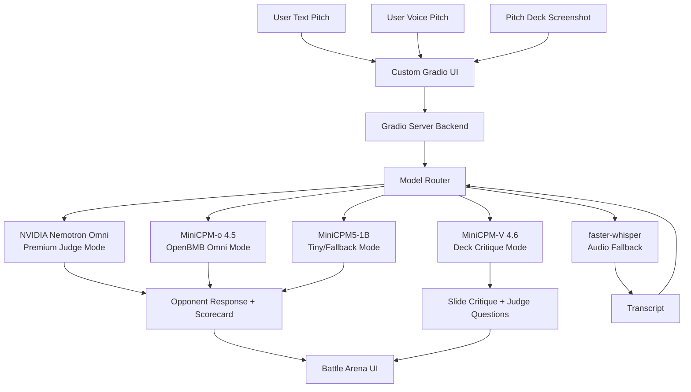

# PitchFight AI — Final Model Strategy

## High-Demo Sponsor-Model Stack Under 32B Parameters

---

## 1. Final Model Philosophy

PitchFight AI prioritizes:

- **Best demonstrative experience** — the app must feel like a real sparring arena, not a chatbot wrapper.
- **Voice-first pitch practice** — founders pitch out loud; the judge responds with pressure, not generic advice.
- **High-quality AI judge behavior** — persona-locked opponents, attack tags, memory, and sharp follow-ups.
- **Sponsor-model alignment** — NVIDIA Nemotron Omni and OpenBMB MiniCPM models used intentionally and visibly.
- **Strong fallback reliability** — if a premium endpoint fails, the app degrades gracefully instead of breaking the demo.
- **Models under 32B parameters** — every reasoning model in the stack complies with the Build Small Hackathon cap.

The project is **not** targeting the **Off-the-Grid** badge. This is intentional — Off-the-Grid is not part of this build.

The app **does** follow the required hackathon rules:

- **≤32B models** for all core reasoning
- **Gradio** + **Hugging Face Spaces** hosting
- **Demo-first** execution with a custom non-default UI

**Target badges/prizes:** Backyard AI, Best Demo, Best Agent, Off-Brand, NVIDIA Nemotron Quest, OpenBMB Awards, Sharing is Caring, and Field Notes.

Cloud/sponsor model APIs are **allowed and expected** for this build when called **backend-only** with keys in HF Space Secrets. They are not forbidden — they are the default path to demo quality.

---

## 2. Final Default Model Stack

| Layer | Final Model | Default? | Purpose |
|---|---|---:|---|
| Premium reasoning + voice/multimodal judge | NVIDIA Nemotron 3 Nano Omni 30B-A3B | Yes | Main voice/text judge, pitch battle, deal battle, scorecard, voice critique |
| OpenBMB omni mode | MiniCPM-o 4.5 | Secondary | OpenBMB-aligned omni mode for voice/text/multimodal pitch interaction |
| Tiny fallback | MiniCPM5-1B | Fallback | Fast text battle, scorecard fallback, Tiny Mode |
| Vision/deck critique | MiniCPM-V 4.6 | Feature mode | Pitch deck screenshot critique and visual pitch feedback |
| Audio fallback | faster-whisper / Whisper Tiny or Base | Fallback | Audio transcription if direct audio handling is unstable |
| Optional multilingual | Cohere Aya or suitable small multilingual model | Optional | Hindi/Kannada/regional pitch practice if added |
| Optional visuals | FLUX / Black Forest Labs model | Optional assets only | Persona art or visual assets, not core reasoning |

---

## 3. Primary Model — NVIDIA Nemotron 3 Nano Omni 30B-A3B

> **Deep dive:** How Omni processes raw audio, paralinguistic signals, hesitation detection, and PitchFight voice paths A/B — see [`NEMOTRON_OMNI_AUDIO.md`](NEMOTRON_OMNI_AUDIO.md).

### Role

Primary premium model for the strongest demo.

### Use cases

- Voice pitch understanding
- AI opponent responses
- Pitch Battle
- Deal Battle
- Multimodal pitch judging
- Scorecard generation
- Weakest answer rewrite
- Improved pitch generation
- Voice-specific feedback
- Optional pitch deck + spoken pitch critique

### Why

- Strong sponsor alignment (NVIDIA Nemotron Quest)
- Multimodal / omni capability
- Under 32B total parameter rule
- Best fit for high-quality voice demo
- Targets NVIDIA Nemotron Quest

### Implementation

- Backend-only API call.
- API key stored in HF Space Secrets.
- Frontend never calls NVIDIA directly.
- Model call goes through `core/nvidia_client.py` and `core/model_router.py`.

### Environment variables

```text
NVIDIA_API_KEY=
NVIDIA_BASE_URL=https://integrate.api.nvidia.com/v1
NVIDIA_OMNI_MODEL=nvidia/nemotron-3-nano-omni-30b-a3b-reasoning
```

### Suggested settings

| Task | Temperature | Max Tokens |
|---|---:|---:|
| Opponent response | 0.7 | 250 |
| Scorecard | 0.2 | 1200 |
| Rewrite | 0.45 | 500 |

---

## 4. OpenBMB Mode — MiniCPM-o 4.5

### Role

OpenBMB-aligned advanced omni model.

### Use cases

- Alternative voice judge mode
- Speech/text pitch interaction
- OpenBMB sponsor route
- Model comparison mode
- Optional multimodal interaction

### Why

- 9B model, under 32B
- Strong OpenBMB alignment
- Supports omnimodal interaction
- Useful for OpenBMB Awards
- Smaller than Nemotron

### Implementation

- Backend-only API call or supported official endpoint.
- Keep separate from NVIDIA path.
- Can be exposed in UI as **“OpenBMB Omni Mode”**.

### Environment variables

```text
OPENBMB_API_KEY=
OPENBMB_BASE_URL=
MINICPM_OMNI_MODEL=openbmb/MiniCPM-o-4_5
```

---

## 5. Tiny / Fallback Mode — MiniCPM5-1B

### Role

Reliable small fallback model.

### Use cases

- Text Pitch Battle fallback
- Deal Battle fallback
- Scorecard fallback
- Tiny Mode
- Low-latency text mode
- Tiny Titan angle if shipped well

### Why

- Very small
- OpenBMB-aligned
- Good backup if premium endpoints are slow
- Keeps app usable during API failures

### Implementation

- Use through backend model router.
- Can be local or hosted depending on final deployment.
- If using API, clearly do not claim Off-the-Grid.
- If local, can be mentioned as optional local fallback.

### Environment variables

```text
MINICPM_TEXT_MODEL=openbmb/MiniCPM5-1B
MINICPM_TEXT_BACKEND=api_or_local
```

---

## 6. Vision Mode — MiniCPM-V 4.6

### Role

Pitch deck screenshot critique.

### Use cases

- Upload slide screenshot
- Extract visible claims
- Critique clarity
- Critique problem/solution/market/ask
- Generate judge questions from slide

### Why

- OpenBMB-aligned
- Small visual model
- Strong demo feature
- Adds multimodal value beyond chat

### Implementation

- Add `/deck_critique` endpoint.
- Frontend image upload.
- Backend routes image to MiniCPM-V or NVIDIA Omni.
- Show slide critique card.

### Environment variables

```text
MINICPM_VISION_MODEL=openbmb/MiniCPM-V-4.6
```

---

## 7. Audio Fallback — faster-whisper

### Role

Backup transcription.

### Use cases

- Convert audio to transcript if direct omni audio fails
- Debug voice input
- Allow browser-recorded audio to become text reliably

### Why

- Reliable
- Simple
- Helps prevent voice demo failure

### Implementation

- **Not** the main judge.
- Only audio-to-text fallback.
- Transcript then goes into selected reasoning model.

### Environment variables

```text
WHISPER_FALLBACK_ENABLED=true
WHISPER_MODEL_SIZE=tiny
```

---

## 8. Model Router

Routing logic for `core/model_router.py`:

### Text Pitch Battle

```text
startup context + persona + attack tag
  → NVIDIA Nemotron by default
  → MiniCPM5-1B fallback if NVIDIA fails
```

### Voice Pitch

```text
audio
  → NVIDIA Nemotron Omni primary
  → if fails: faster-whisper transcription
  → MiniCPM5-1B or Nemotron text path
```

### Deal Battle

```text
negotiation context
  → NVIDIA Nemotron by default
  → MiniCPM5-1B fallback
```

### Scorecard

```text
conversation history
  → NVIDIA Nemotron by default
  → MiniCPM5-1B fallback
  → json_utils parser + fallback_scorecard()
```

### Deck Critique

```text
image
  → MiniCPM-V 4.6 or NVIDIA Omni
  → slide critique + judge questions
```

### OpenBMB Mode

```text
user-selected
  → MiniCPM-o 4.5
```

### Tiny Mode

```text
user-selected or automatic fallback
  → MiniCPM5-1B
```

---

## 9. Model-to-File Mapping

| File | Responsibility | Phase 2 Status |
|---|---|---|
| `core/model_router.py` | Routes tasks to NVIDIA, MiniCPM-o, MiniCPM5, MiniCPM-V, or Whisper fallback | **Created** — premium_nvidia live; other modes stub |
| `core/nvidia_client.py` | Calls NVIDIA Nemotron Omni backend-only | **Created** — live, tested |
| `core/minicpm_client.py` | Calls MiniCPM-o and MiniCPM5 paths | **Stub** — health_check only (Phase 9) |
| `core/vision_client.py` | Handles MiniCPM-V / deck critique model calls | **Stub** — health_check only (Phase 10) |
| `core/transcription_client.py` | Handles faster-whisper fallback transcription | **Stub** — health_check only (Phase 7) |
| `core/session_manager.py` | Stores selected model mode and conversation history | Existing — unchanged |
| `core/persona_builder.py` | Builds prompt before model call | Existing — unchanged |
| `core/attack_tags.py` | Selects pressure direction before model call | Existing — unchanged |
| `core/scoring_engine.py` | Builds scorecard prompt and calls model_router | Existing — still mock (Phase 5) |

> **Reasoning model token note:** `nvidia/nemotron-3-nano-omni-30b-a3b-reasoning` writes an internal chain-of-thought before producing `message.content`. Confirmed defaults: opponent=500, scorecard=2000, rewrite=800 tokens.
| `core/json_utils.py` | Repairs/parses model-generated scorecards |

---

## 10. Environment Variables

Final environment block:

```text
APP_ENV=development
MAX_ROUNDS=6

DEFAULT_MODEL_MODE=premium_nvidia

NVIDIA_API_KEY=
NVIDIA_BASE_URL=https://integrate.api.nvidia.com/v1
NVIDIA_OMNI_MODEL=nvidia/nemotron-3-nano-omni-30b-a3b-reasoning

OPENBMB_API_KEY=
OPENBMB_BASE_URL=
MINICPM_OMNI_MODEL=openbmb/MiniCPM-o-4_5
MINICPM_TEXT_MODEL=openbmb/MiniCPM5-1B
MINICPM_VISION_MODEL=openbmb/MiniCPM-V-4.6

HF_TOKEN=

WHISPER_FALLBACK_ENABLED=true
WHISPER_MODEL_SIZE=tiny

ENABLE_DECK_CRITIQUE=true
ENABLE_DEAL_BATTLE=true
ENABLE_VOICE_MODE=true
```

**Security rules:**

- API keys must be **backend-only**.
- Use **HF Space Secrets** in production.
- Never expose keys in frontend JS.
- Do not commit `.env`.

---

## 11. Requirements Strategy

### Skeleton (always)

```text
gradio
fastapi
uvicorn
pydantic
python-dotenv
numpy
```

### API/model clients

```text
openai
requests
httpx
```

### Voice fallback

```text
faster-whisper
```

### Audio/system

```text
packages.txt includes ffmpeg
```

### Optional image handling

```text
pillow
```

**Note:** Do not add heavy local inference dependencies unless needed. This build prioritizes **API-backed sponsor models** for demo quality. Local inference (e.g. llama-cpp-python) is optional for Tiny Mode fallback only — not the default path.

---

## 12. Model Architecture Diagram


